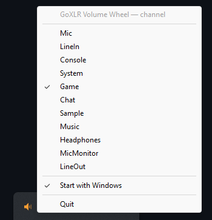

# GoXLR Utility — Volume Wheel

A tiny tray companion for [**GoXLR Utility**](https://github.com/GoXLR-on-Linux/goxlr-utility) that turns your keyboard's volume keys (`VK_VOLUME_UP` / `VK_VOLUME_DOWN`) — or any device that emits them — into a remote control for **any GoXLR channel**, including the channels that aren't currently mapped to a physical fader.

Built on top of [GoXLR Utility](https://github.com/GoXLR-on-Linux/goxlr-utility)'s local WebSocket API. The official daemon does the talking to the device; this app just bridges your input to the right `SetVolume` command and gets out of the way.

[](https://github.com/maximedeprince/go-xlr-utility-volume-wheel/actions/workflows/quality.yml)
[](https://github.com/maximedeprince/go-xlr-utility-volume-wheel/releases/latest)
[](#license)

---

## Why?

The GoXLR (full and Mini) both expose **only 4 physical faders**, but GoXLR Utility actually drives **11 channels**: `Mic`, `LineIn`, `Console`, `System`, `Game`, `Chat`, `Sample`, `Music`, `Headphones`, `MicMonitor`, `LineOut`. The 7 channels you don't have on a fader at any given moment are still adjustable — just not without opening the GoXLR Utility window and clicking around.

This app gives you a **secondary fader you can summon from anywhere**, mapped to whichever channel you need at the moment.

### Use cases

- **Get a "5th fader" on a 4-fader device.** Keep `Mic`/`Chat`/`Music`/`Game` on the physical sliders and bind, say, `Sample` or `MicMonitor` to your keyboard wheel. Switch the target channel in two clicks via the tray.
- **Drive `Headphones`, `MicMonitor` or `LineOut` from the keyboard.** Channels that most people never put on a fader because they're only adjusted occasionally (monitoring volume, headphone level…) — now a tap away.
- **Use a keyboard volume wheel as your main mix control.** Razer Huntsman, Logitech MX-series, Corsair K-line, any board with a media wheel or dedicated volume keys works. The wheel is high-resolution and feels great for fine adjustments — at 5 units per tick, one full turn is a clean ~50 % travel.
- **Use a mouse side-button or a programmable keyboard layer.** If your software (Razer Synapse, Logi Options+, Glorious Core, QMK/VIA, AutoHotkey…) can emit `Volume Up` / `Volume Down`, this app picks it up. No driver hooks needed.
- **Use a Stream Deck, MIDI controller, or game controller mapper.** Anything that can send media keys (Stream Deck's *Hotkey* action, JoyToKey, reWASD, etc.) becomes a GoXLR remote.
- **Headset with inline volume buttons.** Many gaming headsets emit standard media keys for their inline controls — point them at `Headphones` and the inline buttons now actually move *that* channel instead of fighting the Windows master volume.
- **Hands-on-keyboard streaming.** Drop your `Game` or `Music` channel without taking your hands off the keyboard mid-gameplay. The Windows OSD never appears, and the system master volume is left untouched.

## What is GoXLR Utility?

[GoXLR Utility](https://github.com/GoXLR-on-Linux/goxlr-utility) is the open-source replacement for TC-Helicon's official GoXLR App. It runs as a local daemon, talks to the device over USB, and exposes a WebSocket / IPC API that this project consumes. **You need it installed and running** for this app to do anything — see their [installation guide](https://github.com/GoXLR-on-Linux/goxlr-utility#installation).

## Features

- **Volume keys → GoXLR fader.** Up/Down adjust the active GoXLR channel by 5 (out of 0–255), with the Windows OSD suppressed and the system master volume left alone.
- **Tray menu.** Pick the active channel from the full 11-channel list at any time.
- **Auto-start with Windows.** One-click toggle in the tray menu — uses the user `Run` registry key, no admin needed.
- **Smooth motor moves.** Wheel bursts are coalesced and rate-limited (one command every 25 ms) so the physical fader glides instead of jittering.
- **Echo-aware.** Ignores the daemon's own patch echoes for 500 ms after a command, so back-to-back wheel ticks compute against the right value.
- **Auto-reconnect.** Survives the [GoXLR Utility](https://github.com/GoXLR-on-Linux/goxlr-utility) daemon restarting.

## Requirements

- Windows 10 / 11 (x64).
- [GoXLR Utility](https://github.com/GoXLR-on-Linux/goxlr-utility) installed and running locally — the daemon listens on `ws://localhost:14564` (the default; nothing to configure).
- Any input device capable of emitting `Volume Up` / `Volume Down` media keys (keyboard, mouse software, Stream Deck, AutoHotkey, etc.).

## Install

1. Download the latest `go-xlr-utility-volume-button-vX.Y.Z-windows-x64.exe` from the [Releases page](https://github.com/maximedeprince/go-xlr-utility-volume-wheel/releases/latest).
2. (Optional) Verify the SHA256 against the `.sha256` companion file:
   ```powershell
   Get-FileHash .\go-xlr-utility-volume-button-vX.Y.Z-windows-x64.exe -Algorithm SHA256
   ```
3. Move the `.exe` somewhere stable (e.g. `%LOCALAPPDATA%\GoXLR Volume Wheel\`) and double-click to run.
4. (Optional) Right-click the tray icon and tick **Start with Windows**.

> The autostart entry stores the path of the running `.exe`. If you move the file later, toggle autostart off and back on so the registry value points to the new location.

## Usage

Once running, an orange speaker icon appears in the tray. Right-click it to:

- Pick which GoXLR channel the volume keys control (a checkmark shows the active one).
- Toggle **Start with Windows**.
- **Quit**.

<p align="center">
  
</p>

That's it. Press your keyboard's volume up/down — the fader on the chosen channel moves and the Windows OSD stays out of the way.

## How it works

| Layer | What it does |
| --- | --- |
| Win32 low-level keyboard hook (`WH_KEYBOARD_LL`) | Captures `VK_VOLUME_UP` / `VK_VOLUME_DOWN` system-wide and **swallows** them so Windows never sees the press. |
| Tokio WebSocket client | Connects to [GoXLR Utility](https://github.com/GoXLR-on-Linux/goxlr-utility)'s `ws://localhost:14564/api/websocket`, fetches `GetStatus` to learn the mixer serial and current per-channel volumes, then sends `SetVolume` commands. |
| Tray (`tray-icon` crate + Win32 message pump) | Owns the process main thread, exposes the channel/autostart/quit menu. |
| Registry (`HKCU\…\Run\GoXLR Volume Wheel`) | User-scope autostart entry, set/cleared by the tray toggle. |

The daemon echoes every `SetVolume` back as a `Patch` event. The client ignores patches on a channel for 500 ms after it sent a command on that channel — otherwise an in-flight echo would clobber the local cache and make the next wheel tick compute from a stale reading, causing the fader to bounce.

## Build from source

```powershell
# Requires Rust stable (https://rustup.rs)
git clone https://github.com/maximedeprince/go-xlr-utility-volume-wheel.git
cd go-xlr-utility-volume-wheel
cargo build --release
.\target\release\go-xlr-utility-volume-button.exe
```

## Platform support

Windows-only by design. The whole point of the app is Win32's low-level keyboard hook (`SetWindowsHookExW` with `WH_KEYBOARD_LL`), which is the only API on Windows that lets a userspace process **swallow** media keys before the shell consumes them. There is no portable equivalent on macOS or Linux that would make `.pkg` / `.deb` / `.rpm` builds meaningful here.

## Credits

- The [GoXLR-on-Linux](https://github.com/GoXLR-on-Linux) team for **[GoXLR Utility](https://github.com/GoXLR-on-Linux/goxlr-utility)** — the daemon and WebSocket API this project relies on. None of this is possible without their work.
- TC-Helicon for the [GoXLR](https://www.tc-helicon.com/Categories/Tchelicon/Computer-Audio/Broadcast-Mixers/c/P0EUI) hardware.

## License

MIT — see [`Cargo.toml`](Cargo.toml).
